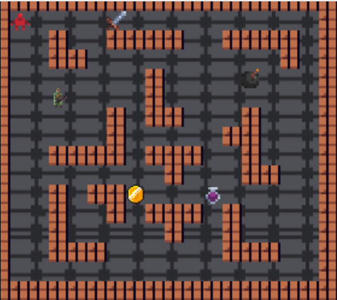

# Dungeonmania Game Refactor

A refactoring-focused project aimed at improving the design, scalability, and maintainability of the Dungeonmania game system (a large-scale codebase) using clean architecture principles, UML modelling, and object-oriented design.

## Game Preview

## Project Overview

Dungeonmania is a dungeon-based puzzle game where players navigate through levels, solve challenges, and interact with entities such as enemies, floor switches, and collectables.

This project focuses on refactoring an existing codebase to improve system structure, readability, and extensibility. The refactor emphasises clean architecture principles and modular design, enabling the system to better support future feature expansion.

Overall, it explores how thoughtful restructuring, improved class design, and separation of concerns can significantly enhance the quality and scalability of an existing software system.

## Tools & Technologies

- Java
- Object-Oriented Design
- UML Modelling
- Gradle
- Checkstyle
- Git & Version Control

## Key Features

- Refactored codebase to improve **readability and maintainability**
- Applied **DRY principles** to eliminate redundancy
- Improved **inheritance structures and class design**
- Introduced **modular and scalable architecture**
- Enhanced system organisation for **future feature expansion**
- Structured project using **clean architecture principles**

## Before Refactoring

- **Tightly coupled classes** with unclear responsibilities
- **Repetitive logic** across components violating DRY principles
- **Rigid design** limiting feature extensibility
- **Poor separation of concerns** between game logic and supporting systems
- **Low maintainability** due to inconsistent structure

## After Refactoring

- **Modular design** with clear separation of concerns
- **Improved class hierarchy** using abstraction and inheritance
- **Reduced code duplication** through DRY principles
- **Scalable architecture** enabling easier feature expansion
- **High maintainability** with cleaner, more readable code

## Repository Note

This project was originally developed in a private GitLab repository hosted by the university. After graduation, access to the original environment expired, so the game may not be fully runnable. This repository contains the full codebase and design artefacts demonstrating the refactoring approach used in the project.

## Author

Sneha Besu  
